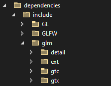

# CGJ Project

### Group 1
Jo�o Oliveira 93728
Giulio Camasso 105147

## Instalation

### Dependencies

glfw3 (https://www.glfw.org/)
- copy glfw3.lib and glfw3dll.lib to dependencies/lib 
- copy the contents of the include folder to dependencies/include

glew (https://glew.sourceforge.net/)
- copy glew32.dll and glew32.lib to dependencies/lib
- copy the contents of the include folder to dependencies/include

glm (https://github.com/g-truc/glm/releases/tag/0.9.9.8)
- copy the contents of the first glm folder to dependencies/include

assimp:
	Libraries and dlls were compiled in vs2022, in a 64 bit windows 10 machine

The dependencies' folder structure should be the following

### Building & Running

Execute "Build All" (Ctrl+shift+B) by default
In VS, you can use the Search bar to find this option

Navigate to tangram/tangram.cpp and open the file
Select Startup Item (tangram.exe)
Run

The executable will be accessible in TEngine\out\build\x64-Debug\tangram but it must be in the
same directory as the assets folder and glew32.dll.

"Build All", should copy the assets folder into the same directory as the executable, if
it does not, please copy it manually.

### Program

The screen should show the gun model tangram with a blue background.
You can resize the window.

You can also move, scale and rotate the tangram using the following inputs:

WASD - move tangram
Scroll Wheel - scale tangram (zoom)
Q and E - rotate tangram